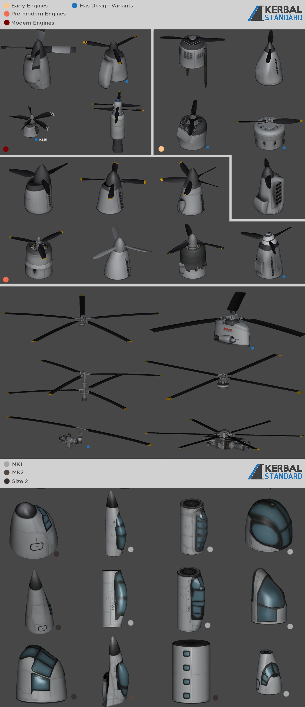
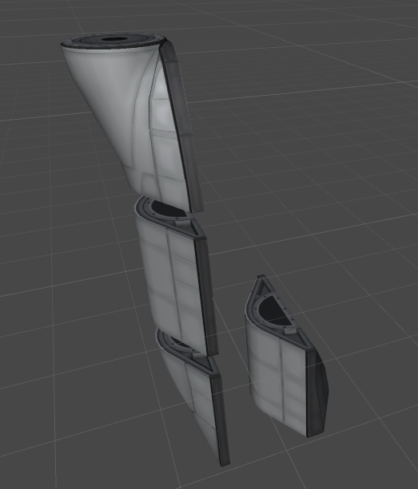
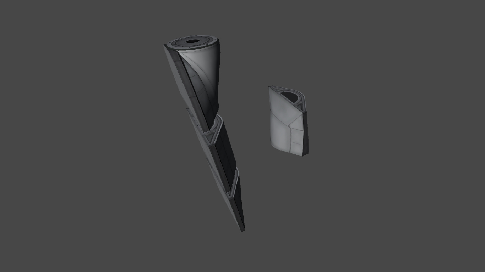
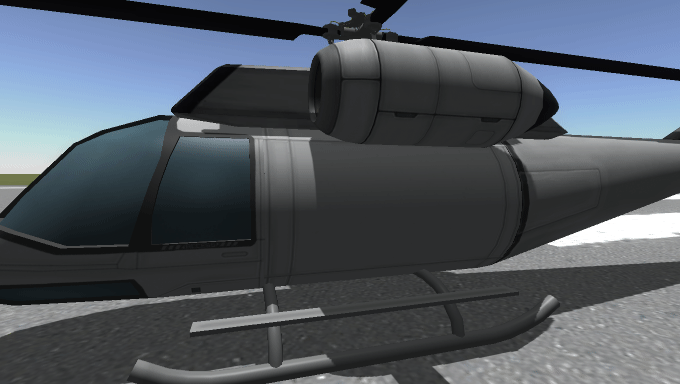

# Airplane+ /L Unofficial

Powerful stockalike parts for aircraft enthusiasts.

Unofficial fork by Lisias.

## In a Hurry

* [Latest Release](https://github.com/net-lisias-kspu/AirplanePlus/releases)
	+ [Binaries](https://gitlab.com/net-lisias-ksph/AirplanePlus/-/tree/Archive)
* [Source](https://github.com/net-lisias-kspu/AirplanePlus)
* Documentation
	+ [Project's README](https://github.com/net-lisias-kspu/AirplanePlus/blob/master/README.md)
	+ [Install Instructions](https://github.com/net-lisias-kspu/AirplanePlus/blob/master/INSTALL.md)
	+ [Change Log](./CHANGE_LOG.md)
	+ [Known Issues](./KNOWN_ISSUES.md) list

## Description

Aircraft Collection Album: https://imgur.com/a/ySFgL

The latest information, craft files, pictures and Manual Patches from Users are also in the forums (Tweakscale and RPM for certain parts).

Adds a collection plane parts which came from different timelines.. All of which are in the image album. Feel free to take a look. If you think that there are too many parts, consult the part deleter's guide in the zip.

Most engine performance configurations made possible with the help of Tanner Rawlings.

### Images

#### Halved Mk2 Parts

#### Mk1 Sliding Door Cargo Bay

#### Cockpits

See [imgur album](http://imgur.com/a/q3FAx)

#### Landing Gears Demo Video

<iframe width="560" height="315" src="https://www.youtube.com/embed/WVW5x16ZSCA" title="YouTube video player" frameborder="0" allow="accelerometer; autoplay; clipboard-write; encrypted-media; gyroscope; picture-in-picture" allowfullscreen></iframe>

## Installation

Detailed installation instructions are now on its own file (see the [In a Hurry](#in-a-hurry) section) and on the distribution file.

## License:

### Source Code

Source code on the subdirectory [Source](./Source) (and the respective compiled code, DLLs) are double licensed as follows:

* [SKL 1.0](https://ksp.lisias.net/SKL-1_0.txt). See [here](./LICENSE.KSPe.SKL-1_0)
	+ You are free to:
		- Use : unpack and use the material in any computer or device
		- Redistribute : redistribute the original package in any medium
	+ Under the following terms:
		- You agree to use the material only on (or to) KSP
		- You don't alter the package in any form or way (but you can embedded it)
		- You don't change the material in any way, and retain any copyright notices
		- You must explicitly state the author's Copyright, as well an Official Site for downloading the original and new versions (the one you used to download is good enough)
* [GPL 2.0](https://www.gnu.org/licenses/gpl-2.0.txt). See [here](./LICENSE.KSPe.GPL-2_0)
	+ You are free to:
		- Use : unpack and use the material in any computer or device
		- Redistribute : redistribute the original package in any medium
		- Adapt : Reuse, modify or incorporate source code into your works (and redistribute it!)
	+ Under the following terms:
		- You retain any copyright notices
		- You recognise and respect any trademarks
		- You don't impersonate the authors, neither redistribute a derivative that could be misrepresented as theirs.
		- You credit the author and republish the copyright notices on your works where the code is used.
		- You relicense (and fully comply) your works using GPL 2.0 (or later)
		- You don't mix your work with GPL incompatible works.
* If by some reason the GPL would be invalid for you, rest assured that you still retain the right to Use the Work under SKL 1.0.

And you has the choice to choose the license that best suits your needs.

### Assets

Unless explicitly stated otherwise, all assets under the following subdirectories on `GameData/AirplanePlus`:

* [Agencies](./GameData/AirplanePlus/Agencies)
* [Compatibility](./GameData/AirplanePlus/Compatibility)
* [FX](./GameData/AirplanePlus/FX)
* [Parts](./GameData/AirplanePlus/Parts)
* [Props](./GameData/AirplanePlus/Props)
* [Sounds](./GameData/AirplanePlus/Sounds)
* [Spaces](./GameData/AirplanePlus/Spaces)

are licensed under the [CC BY-NC-SA 4.0](https://creativecommons.org/licenses/by-nc-sa/4.0/?), what allows you to:

* copy and redistribute the material in any medium or format
* create derivatives
 
But explicitly forbids you to:

* Exploit it commercially

Please note the copyrights and trademarks in [NOTICE](./NOTICE).

## UPSTREAM

* [blackheart612](https://forum.kerbalspaceprogram.com/index.php?/profile/42741-blackheart612/)
	+ [KSP Forum](https://forum.kerbalspaceprogram.com/index.php?/topic/140262-14x-144-airplane-plus-r230-full-1875m-parts-crj-series-new-jet-engine-fixes-jul-20-2018/)
	+ Imgur
		- [AirplanePlus](https://imgur.com/a/6kDLM)
		- [Cockpits R8.0](https://imgur.com/a/q3FAx) 
	+ [Spacedock](https://spacedock.info/mod/716/Airplane%20Plus)
	+ [CurseForge](https://www.curseforge.com/kerbal/ksp-mods/airplane-plus)
	+ [GitHub](https://github.com/blackheart612/AirplanePlus)
